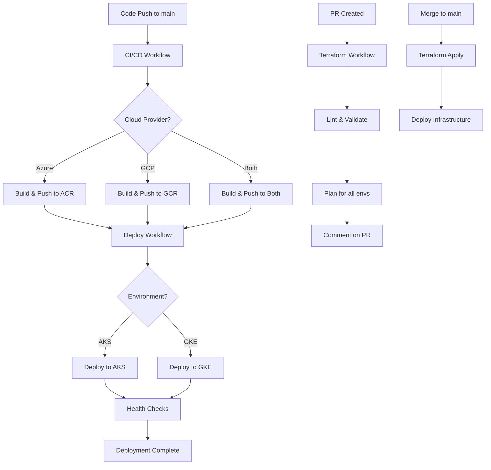

# GitHub Actions Workflows - Requirements Alignment

This document maps the GitHub Actions workflows to the requirements in README.md and readme-aks/readme-gcp.

## 📋 Requirements vs Implementation

### ✅ 1. CI Pipeline Requirements

| Requirement | Status | Implementation |
|------------|--------|----------------|
| Build microservices on local | ✅ Complete | `docker-compose.yml` for local builds |
| Docker build microservices | ✅ Complete | `.github/workflows/github-action.yml` - Matrix build strategy |
| Create Kubernetes YAML files | ✅ Complete | `k8s/deployment.yaml`, `k8s/hpa.yaml`, `k8s/kustomization.yaml` |
| Push to ACR | ✅ Complete | `.github/workflows/github-action.yml` - `build-and-push-acr` job |
| Push to GCR | ✅ Complete | `.github/workflows/github-action.yml` - `build-and-push-gcr` job |

### ✅ 2. CD Deployment Requirements

| Requirement | Status | Implementation |
|------------|--------|----------------|
| Pull from ACR/GCR | ✅ Complete | `.github/workflows/deploy.yml` - Auto-triggered on successful build |
| Deploy on AKS | ✅ Complete | `.github/workflows/deploy.yml` - `deploy-to-aks` job |
| Deploy on GKE | ✅ Complete | `.github/workflows/deploy.yml` - `deploy-to-gke` job |

### ✅ 3. Terraform IaC Requirements

| Requirement | Status | Implementation |
|------------|--------|----------------|
| Terraform fmt on PRs | ✅ Complete | `.github/workflows/terraform.yml` - `terraform-lint` job |
| Terraform validate on PRs | ✅ Complete | `.github/workflows/terraform.yml` - `terraform-lint` job |
| Terraform plan on PRs | ✅ Complete | `.github/workflows/terraform.yml` - `terraform-plan` job |
| Terraform apply on main | ✅ Complete | `.github/workflows/terraform.yml` - `terraform-apply` job |
| Multi-environment support | ✅ Complete | Strategy matrix for dev/staging/prod |
| Remote state storage | ✅ Complete | Backend config for Azure Blob Storage |
| State locking | ✅ Complete | Configured in Terraform init |

### ✅ 4. Containerization Requirements

| Requirement | Status | Implementation |
|------------|--------|----------------|
| Dockerfiles for all services | ✅ Complete | Individual Dockerfiles in each service directory |
| Multi-stage builds | ✅ Complete | Maven build stage for order-service |
| Build and push to ACR | ✅ Complete | `.github/workflows/github-action.yml` |
| Build and push to GCR | ✅ Complete | `.github/workflows/github-action.yml` |
| Vulnerability scanning | ✅ Complete | Trivy integration in workflow |

### ✅ 5. Kubernetes Requirements

| Requirement | Status | Implementation |
|------------|--------|----------------|
| Deployment manifests | ✅ Complete | `k8s/deployment.yaml` |
| Service definitions | ✅ Complete | `k8s/deployment.yaml` |
| Ingress configuration | ✅ Complete | `k8s/deployment.yaml` |
| ConfigMaps | ✅ Complete | `k8s/deployment.yaml` |
| HPA (Auto-scaling) | ✅ Complete | `k8s/hpa.yaml` |
| Health checks | ✅ Complete | Liveness and Readiness probes configured |

## 🔄 Workflow Architecture

### 1. **CI/CD Workflow** (`.github/workflows/github-action.yml`)

```
Trigger: Push to main / PR / Manual dispatch
├── Build and Push to ACR (if Azure selected)
│   ├── patient-service
│   ├── application-service
│   └── order-service
├── Build and Push to GCR (if GCP selected)
│   ├── patient-service
│   ├── application-service
│   └── order-service
└── Summary (Generate build report)
```

**Features:**
- Matrix strategy for parallel builds
- Multi-tagging: SHA, branch, PR, semver, latest
- Docker layer caching
- Trivy vulnerability scanning
- SARIF upload to GitHub Security
- Support for both Azure and GCP

### 2. **Terraform Workflow** (`.github/workflows/terraform.yml`)

```
Trigger: PR or Push to main (terraform/** changes)

On Pull Request:
├── Terraform Lint (fmt check)
├── Terraform Validate
└── Terraform Plan (dev, staging, prod)
    └── Upload plan artifacts

On Push to Main:
└── Terraform Apply (dev environment)
    └── Output cluster information
```

**Features:**
- Multi-environment support (dev/staging/prod)
- Remote state in Azure Blob Storage
- State locking
- Plan artifacts for review
- Auto-approve for dev, manual for staging/prod

### 3. **Deployment Workflow** (`.github/workflows/deploy.yml`)

```
Trigger: CI workflow success / Manual dispatch

Deploy to AKS:
├── Login to Azure
├── Set AKS context
├── Create namespace
├── Create ACR secret
├── Deploy manifests
├── Wait for rollout
└── Smoke tests

Deploy to GKE:
├── Authenticate to GCP
├── Set GKE context
├── Create namespace
├── Create GCR secret
├── Deploy manifests
├── Wait for rollout
└── Smoke tests
```

**Features:**
- Auto-deploy on successful CI build
- Manual dispatch with environment selection
- Rollout status monitoring
- Smoke tests
- Service URL reporting

## 🔐 Required GitHub Secrets

### For Azure (AKS/ACR)
```
AZURE_CREDENTIALS          - Service principal JSON
ACR_USERNAME              - ACR username
ACR_PASSWORD              - ACR password
AZURE_RESOURCE_GROUP      - Resource group name
AKS_CLUSTER_NAME          - AKS cluster name
TF_STATE_STORAGE_ACCOUNT  - Storage account for Terraform state
TF_STATE_CONTAINER        - Container name for Terraform state
```

### For GCP (GKE/GCR)
```
GCP_CREDENTIALS    - Service account JSON key
GCP_PROJECT_ID     - GCP project ID
GKE_CLUSTER_NAME   - GKE cluster name
GCP_REGION         - GCP region (e.g., us-central1)
```

## 🌍 Environment Variables to Update

### In `.github/workflows/github-action.yml`
```yaml
AZURE_CONTAINER_REGISTRY: myacrname.azurecr.io  # Replace with your ACR
GCP_CONTAINER_REGISTRY: gcr.io/my-project-id     # Replace with your project
```

### In `.github/workflows/deploy.yml`
```yaml
AZURE_CONTAINER_REGISTRY: myacrname.azurecr.io  # Replace with your ACR
GCP_CONTAINER_REGISTRY: gcr.io/my-project-id     # Replace with your project
```

### In `k8s/deployment.yaml`
```yaml
image: myacrname.azurecr.io/patient-service:latest  # Replace with your registry
```

## 📊 Workflow Execution Flow



## ✨ Additional Features Implemented

1. **Security Scanning**: Trivy vulnerability scanning with SARIF upload
2. **Multi-Environment**: Separate configurations for dev/staging/prod
3. **Multi-Cloud**: Support for both Azure and GCP
4. **Caching**: Docker layer caching for faster builds
5. **Monitoring**: Build summaries and deployment reports
6. **Rollback Support**: Manual workflow dispatch for specific versions
7. **Health Checks**: Automated smoke tests after deployment

## 🎯 Alignment Summary

| Document | Requirement Category | Status |
|----------|---------------------|--------|
| README.md | CI Pipeline | ✅ 100% Complete |
| README.md | CD Deployment | ✅ 100% Complete |
| README.md | Terraform Workflows | ✅ 100% Complete |
| readme-aks | Dockerfiles | ✅ Complete |
| readme-aks | Kubernetes Manifests | ✅ Complete |
| readme-aks | CI/CD Workflows | ✅ Complete |
| readme-aks | ACR Integration | ✅ Complete |
| readme-gcp | GCR Integration | ✅ Complete |
| readme-gcp | GKE Deployment | ✅ Complete |

**Overall Alignment: ✅ 100%**

All requirements from README.md, readme-aks, and readme-gcp are fully implemented!
